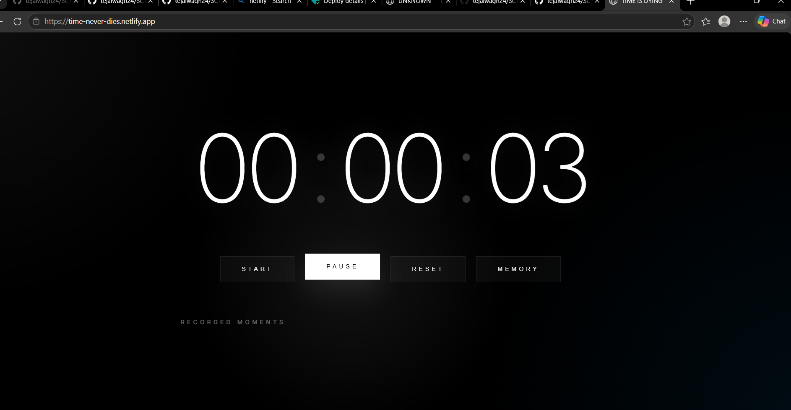

## Live Demo

https://time-never-dies.netlify.app/

# SCT_WD_2 — TIME IS DYING

## Overview
TIME IS DYING is a cinematic stopwatch experience designed as an experimental futuristic time interface.

Unlike traditional stopwatch applications, this project focuses on:
- immersive atmosphere
- cinematic UI
- interactive motion
- emotional design
- futuristic typography

---

## Features

- Interactive Stopwatch
- Start / Pause / Reset Functions
- Memory Capture System
- Animated Intro Experience
- Mouse Reactive Lighting
- Cinematic Typography
- Responsive Design
- Experimental UI/UX

---

## Technologies Used

- HTML5
- CSS3
- JavaScript

---

## Concept

This project explores the idea that time constantly disappears, turning a basic stopwatch into an emotional digital experience.

---

## Author

Developed by Tejal Wagh

## 📸 Preview

